## **#1 Rescue System aktivieren**
Ausschnit aus dem [Artikel "Rescue-System" des offiziellen Hetzner-Wikis](https://wiki.hetzner.de/index.php/Hetzner_Rescue-System):
* *Über das Rescue-System:*
>  *Das Hetzner Rescue-System ist eine Linux-Live-Umgebung, die Ihnen administrativen Zugriff auf Ihren Server ermöglicht. Die Umgebung startet aus dem Netzwerk (PXE-Boot) und läuft im Arbeitsspeicher Ihres Servers. Dadurch ist es möglich, Reparaturen an dem installierten System durchzuführen, Dateisysteme zu überprüfen oder **ein neues Betriebssystem zu installieren**.*

* Wie man das Rescue-System aktiviert:
> Um einen Server in das Rescue-System zu starten, muss dieses [im Robot](https://robot.your-server.de/server) aktiviert werden.
>  
> Unter "Hauptfunktionen; Server" wählen Sie den gewünschten Server aus und öffnen Sie den **Tab "Rescue"**. Dort können Sie die gewünschte Variante aktivieren. *(--> <u>**Debian** auswählen</u>)*

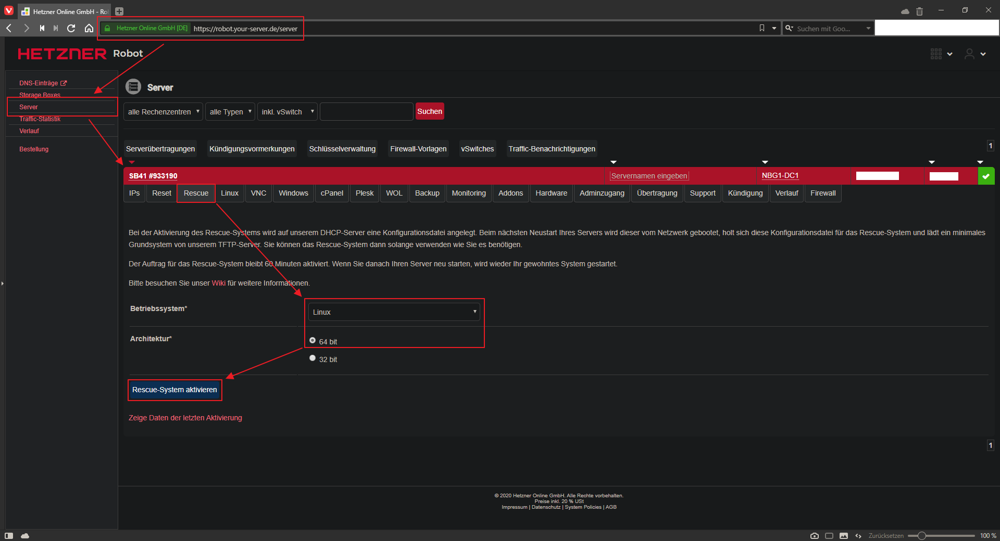


## **#2 Server Neustarten**
> Um das Rescue-System zu laden, müssen Sie den Server neustarten.
> 
> Falls Sie keinen Zugriff mehr auf den Server haben, können Sie dazu die Reset-Funktion [im Robot](https://robot.your-server.de/server) verwenden. Diese finden Sie im Tab "**Reset**" des gewünschten Servers.


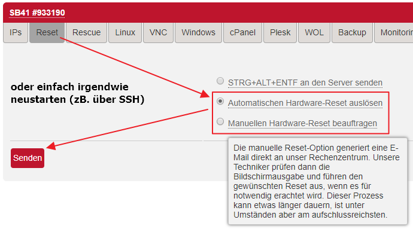


## **#3 per SSH verbinden**
> Das Passwort, das Ihnen beim Aktivieren des Rescue-Systems angezeigt wurde, können Sie anschließend verwenden, um sich mit Hilfe des "**root**"-Benutzers **per SSH auf Ihrem Server anzumelden.**


## **#4 `installimage`-Skript ausführen**
Ausschnit aus dem [Artikel "Installimage" des offiziellen Hetzner-Wikis](https://wiki.hetzner.de/index.php/Installimage):
> Das von uns angebotene installimage Skript ermöglicht **eine einfache und schnelle Installation von verschiedenen Linux-Betriebssytemen.**
> 
> Installimage wird direkt im Rescue-System auf Ihrem Server gestartet. Es bietet Ihnen eine **menügsteuerte Auswahl des von Ihnen gewünschten Betriebssystems**. Sie haben volle Kontrolle über die Aufteilung Ihren Festplatte(n) und können auch die Verwendung von Software-RAID sowie LVM in einem einfachen Editor definieren. 
> 
> ...
> 
> Die Skripte wurden von Entwicklern der Hetzner Online GmbH geschrieben und werden weiter gepflegt und erweitert. [**Die Skripte sowie die Programmiersprache sind frei zugänglich und können von jedem eingesehen**, verwendet und frei abgeändert **werden**](https://github.com/hetzneronline/installimage). \
> *Die Hetzner Online GmbH übernimmt keinerlei Haftung für Schäden, die durch das Ändern der Skripte entstanden sind und schließen jeglichen Support für Anleitungen, die das Verändern des Skriptes beinhalten aus.*


Da dieses Skript bereits unter `/root/.oldroot/nfs/install/installimage` hinterlegt und entsprechend verknüpft ist, kann man einfach in der Kommandozeile `installimage` eingeben:
```console
root@rescue ~ # installimage
```

Beispiel mithilfe von PuTTY:\
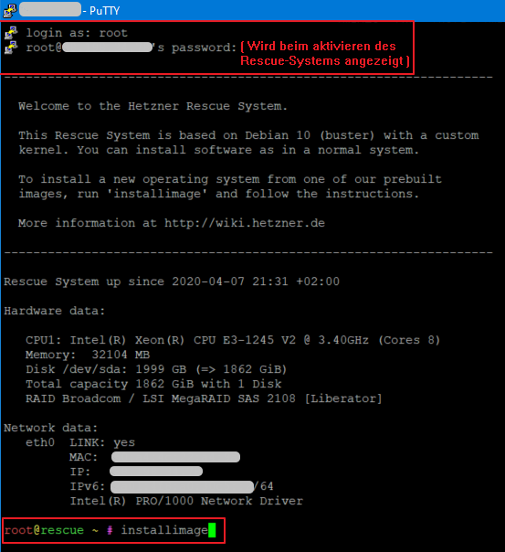

## **#4.1 Image auswählen**

So gut wie direkt nachdem man den `installimage`-Befehl eingegeben hat bekommt man einen [Terminal-Dialog](http://linuxcommand.org/lc3_adv_dialog.php) angezeigt in dem man sein gewünschtes Distro-Image (inkl. dessen verknüpften `installimage`-Installationsschritte) auswählen kann. 

Alle Skripts hier beruhen darauf, dass das unterliegende System ein schlankes Debian-10. (Kein vorinstallierte/vorkonfiguriertes LAMP!)
* Im ersten Menu den Punkt **`Debian`** wählen
* Im folgenden Menü **`Debian-103-buster-minimal`** wählen
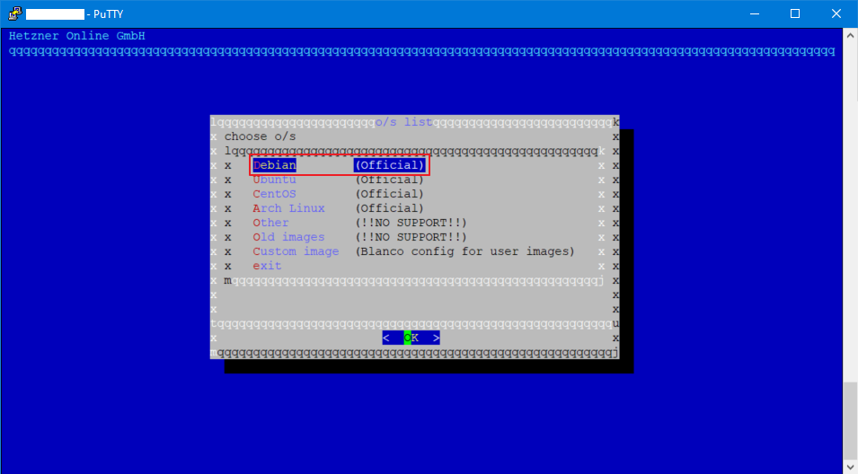
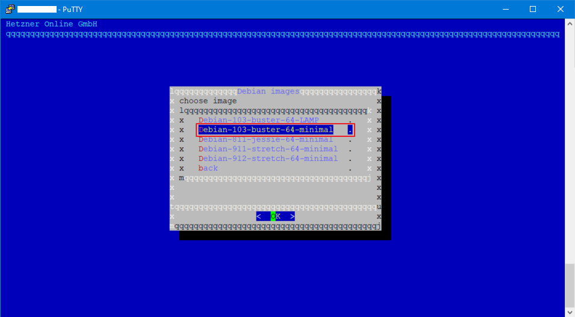

## **#4.2 Installations-Konfiguration anpassen**
Nach der Auswahl des Images wird nun mithilfe von [`mcedit`](https://linux.die.net/man/1/mcedit) die Datei `install.conf` zum Bearbeiten geöffnet.
Diese Datei wird nach dem Speichern vom Skript gesource'd, dessen entnommenen Werte auf simple Kriterien überprüft und für die folgende Installation verwendet.


1. Hostname
```bash
## =========.....

## which hostname should be set?
##.

## This must be a FQDN otherwise installation will fail
##.

HOSTNAME hetznersb41.jonaspammer.at

## =========.....
```
> As a Screenshot: \
> 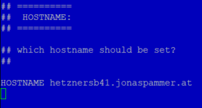

1. Partitionierung:
> Anmerkung zur Parititionierung: In diesem Fall hat mein Server (SB41) folgende Spezifikationen (Den Verfügbaren Speicherplatz hat das Hetzner-Skript selbst ermittelt und wird auch als Kommentar in der geöffneten Konfiguration angezeigt, siehe Bild):
> 
> * 2x HDD SATA 2,0 TB Enterprise
> * RAID Controller 4-Port SATA PCI-E (LSI MegaRAID SAS 9260-4i)
>   * --> Standardmäßig als RAID 0 eingestellt. (Siehe [Hetzner-Wiki: Partitionsgrößenlimit bei großen Festplatten/en: RAID: Hardware RAID Controller](https://wiki.hetzner.de/index.php/Partitionsgrößenlimit_bei_großen_Festplatten/en#RAID))*

```bash
...
## your system has the following devices:
#
# Disk /dev/sda: 1999 GB (=> 1862 GiB).
#
## Based on your disks and which RAID level you will choose you have the following free space to allocate (in GiB):
# RAID  0: ~1862
# RAID  1: ~1862
# .....
# 
PART  swap   swap  32G
PART  /boot  ext4  1G
PART  /      ext4  all
## =========.....
```
> As a Screenshot: \
> 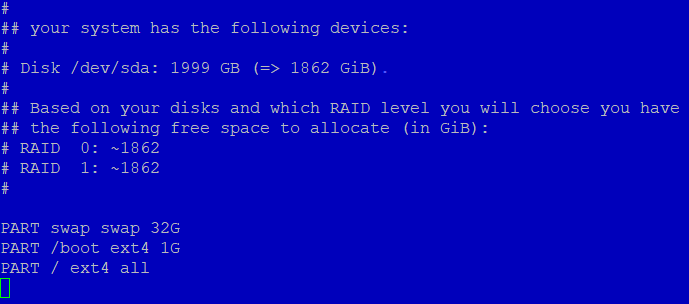


## **#4.3 Installation starten**

Nachdem man alle Konfigurationen vorgenommen hat kann man mcedit mithilfe von `F10` (oder mit der Maus unten Rechts auf die Pseudo-Schaltfläche `10 Quit    ` klicken) schließen. 
Im folgendem Dialog muss man mit `Yes` unsere Änderungen an der Datei bestätigen (aka. Speichern).

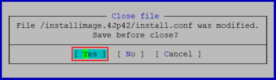

Hiernach werden wir auch mehrmals mithilfe von dialog-Prompts darüber gewarnt, das ALLE DATEN AUF DER FESPLATTE /dev/sda VERLOREN GEHEN. 

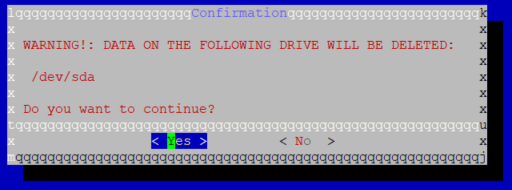

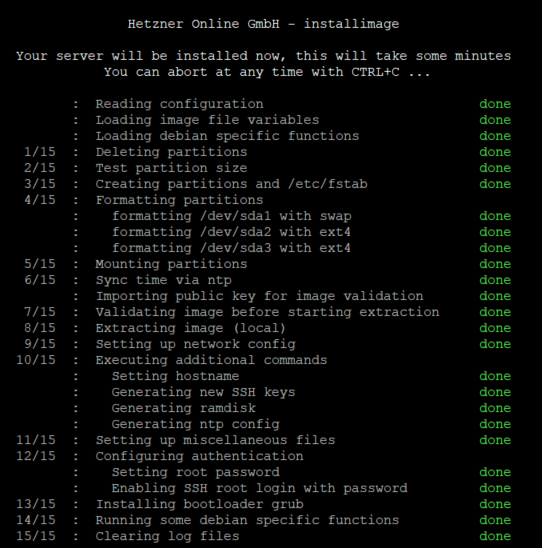
...\
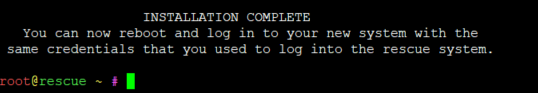

Nachdem die Installations/Konfigurationsroutine des `installimage`-Skriptes beendet wurde müssen wir nur-noch den Server neustarten:
```console
root@rescue ~ # reboot
```

> Hinweis: Das `root`-Passwort ist bis wir es später ändern immer-noch das wie vorhin (vom Rescue-System).